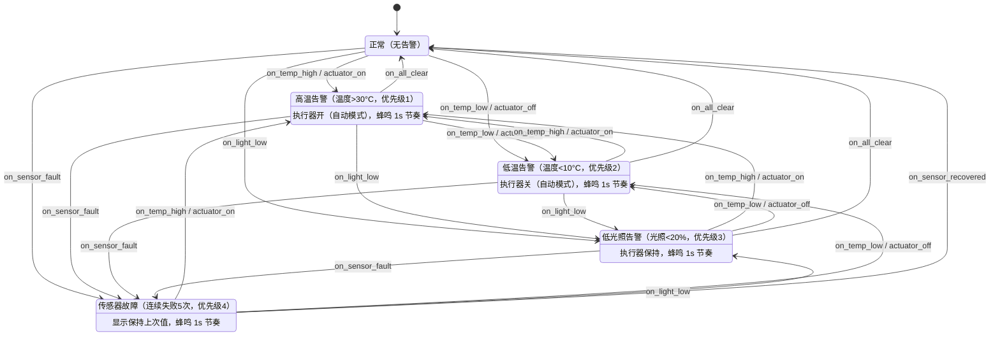

<!-- app_alarm_control 告警管理（REQ-005/REQ-006）：四级优先级告警状态机
     HIGH_TEMP(1) > LOW_TEMP(2) > LOW_LIGHT(3) > SENSOR_FAULT(4)，
     多条件同时满足时迁移到优先级最高的告警态。每次环境数据更新/故障事件触发重评估，
     全部条件解除回 NORMAL。迁移动作联动执行器（仅自动模式生效）：
     进 HIGH_TEMP 执行器开、进 LOW_TEMP 执行器关、其他迁移保持（设计输入：高温开低温关其他保持）。
     告警态蜂鸣器 1s 响 1s 停节奏（静音态不响，由模块 poll 按模式/静音门控）。
     手动模式 KEY1 开关执行器走模块公开接口 on_key_switch，不经过本状态机迁移 -->

