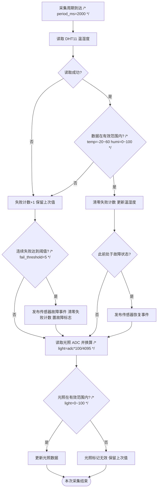

<!-- app_env_sensor 环境采集（REQ-001/002/013）：2s 周期采集 DHT11 温湿度 + 光照 ADC，
     数据有效性范围校验，DHT11 连续 5 次失败触发传感器故障事件，成功后恢复。
     器件单总线协议由 driver_dht11 承载，光照经 adc_port 采样 -->

```mermaid
flowchart TD
    A[采集周期到达 /* period_ms=2000 */] --> B[读取 DHT11 温湿度]
    B --> C{读取成功?}
    C -- 否 --> D[失败计数+1 保留上次值]
    D --> E{连续失败达到阈值? /* fail_threshold=5 */}
    E -- 是 --> F[发布传感器故障事件 清零失败计数 置故障标志]
    E -- 否 --> G[读取光照 ADC 并换算 /* light=adc*100/4095 */]
    F --> G
    C -- 是 --> H{数据在有效范围内? /* temp=-20~60 humi=0~100 */}
    H -- 否 --> D
    H -- 是 --> I[清零失败计数 更新温湿度]
    I --> J{此前处于故障状态?}
    J -- 是 --> K[发布传感器恢复事件]
    J -- 否 --> G
    K --> G
    G --> L{光照在有效范围内? /* light=0~100 */}
    L -- 是 --> M[更新光照数据]
    L -- 否 --> N[光照标记无效 保留上次值]
    M --> O([本次采集结束])
    N --> O
```
