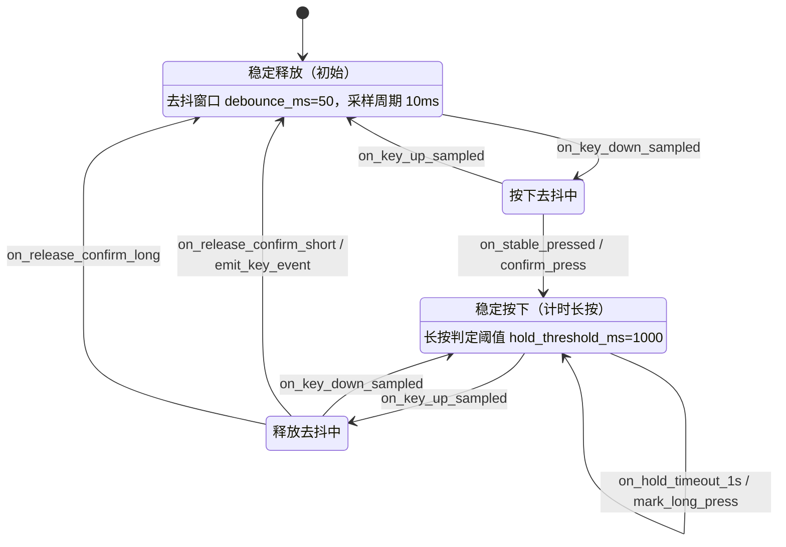

<!-- app_key_handler 按键交互（REQ-004）：3 个按键（模式切换/手动开关/静音切换），
     10ms 周期扫描 + 50ms 软件去抖，短按（<1s）在释放时刻产生按键事件，
     长按无功能（预留），抖动不产生误动作。本状态机为单按键实例模型，代码侧按 3 键各持一份上下文 -->

```mermaid
stateDiagram-v2
    [*] --> RELEASED
    RELEASED --> DEBOUNCE_PRESS : on_key_down_sampled
    DEBOUNCE_PRESS --> PRESSED : on_stable_pressed / confirm_press
    DEBOUNCE_PRESS --> RELEASED : on_key_up_sampled
    PRESSED --> DEBOUNCE_RELEASE : on_key_up_sampled
    PRESSED --> PRESSED : on_hold_timeout_1s / mark_long_press
    DEBOUNCE_RELEASE --> PRESSED : on_key_down_sampled
    DEBOUNCE_RELEASE --> RELEASED : on_release_confirm_short / emit_key_event
    DEBOUNCE_RELEASE --> RELEASED : on_release_confirm_long

    state "稳定释放（初始）" as RELEASED
    state "按下去抖中" as DEBOUNCE_PRESS
    state "稳定按下（计时长按）" as PRESSED
    state "释放去抖中" as DEBOUNCE_RELEASE
    RELEASED : 去抖窗口 debounce_ms=50，采样周期 10ms
    PRESSED : 长按判定阈值 hold_threshold_ms=1000
```
