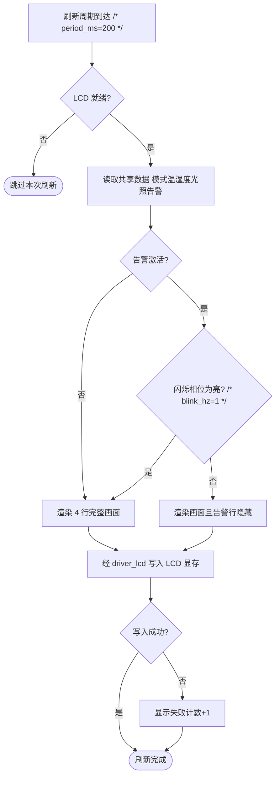

```mermaid
flowchart TD
    A[刷新周期到达 /* period_ms=200 */] --> B{LCD 就绪?}
    B -- 否 --> Z([跳过本次刷新])
    B -- 是 --> C[读取共享数据 模式温湿度光照告警]
    C --> D{告警激活?}
    D -- 否 --> E[渲染 4 行完整画面]
    D -- 是 --> F{闪烁相位为亮? /* blink_hz=1 */}
    F -- 是 --> E
    F -- 否 --> G[渲染画面且告警行隐藏]
    E --> H[经 driver_lcd 写入 LCD 显存]
    G --> H
    H --> I{写入成功?}
    I -- 是 --> J([刷新完成])
    I -- 否 --> K[显示失败计数+1]
    K --> J
```
