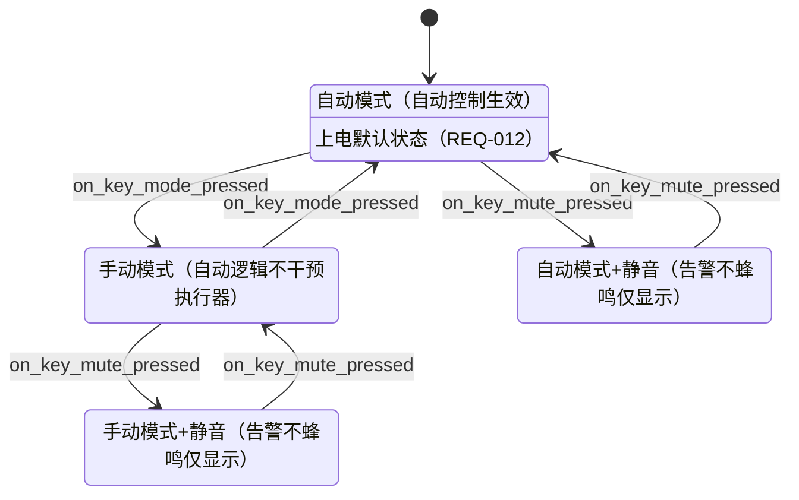

<!-- app_mode_control 工作模式管理（REQ-012/REQ-007）：正交叠加模型。
     KEY0 短按切换自动/手动；WK_UP 短按切换静音（可与自动/手动叠加，静音解除后回到原工作模式）。
     对外呈现收敛为三值：静音态显示 MUTED，非静音态显示 AUTO/MANUAL -->

```mermaid
stateDiagram-v2
    [*] --> AUTO
    AUTO --> MANUAL : on_key_mode_pressed
    MANUAL --> AUTO : on_key_mode_pressed
    AUTO --> AUTO_MUTED : on_key_mute_pressed
    AUTO_MUTED --> AUTO : on_key_mute_pressed
    MANUAL --> MANUAL_MUTED : on_key_mute_pressed
    MANUAL_MUTED --> MANUAL : on_key_mute_pressed

    state "自动模式（自动控制生效）" as AUTO
    state "手动模式（自动逻辑不干预执行器）" as MANUAL
    state "自动模式+静音（告警不蜂鸣仅显示）" as AUTO_MUTED
    state "手动模式+静音（告警不蜂鸣仅显示）" as MANUAL_MUTED
    AUTO : 上电默认状态（REQ-012）
```
