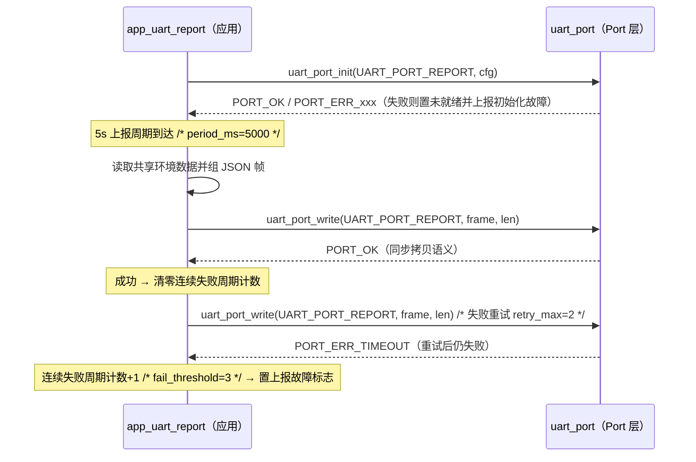

<!-- app_uart_report 串口上报（REQ-008/REQ-009）：5s 周期经 uart_port 向上位机上报 JSON 帧
     {"temp":25,"humi":60,"light":75,"mode":"AUTO","alarm":"NORMAL"}\r\n。
     发送失败同周期内重试（retry_max=2），连续 3 个周期失败置上报故障标志（LED1 快闪，由 app.c 呈现）。
     初始化失败时模块置未就绪，跳过上报（REQ-010 降级） -->

