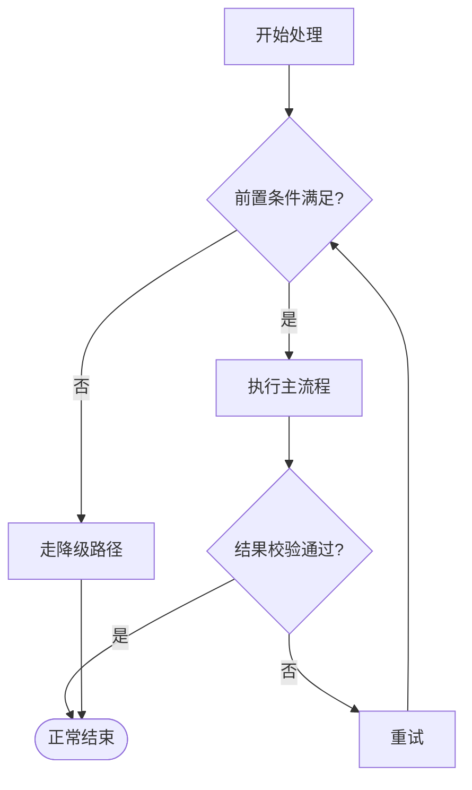

<!-- 顺序流程图骨架：规范见 references/mermaid_flowchart_guide.md -->
<!-- 硬规则：首行固定 flowchart TD；节点 id 英文、中文写 label；
     判断节点出边条件成对完备；失败分支不得悬空；一模块一图 -->

<!--
语法子集（全部可选写法）：
    A[矩形]        处理节点
    A([圆角])      起止节点
    A{菱形}        判断节点
    A[[子程序]]    调用子流程（必须对应独立函数）
    A((圆形))      终止/连接点
    A --> B        无条件边
    A -->|cond| B  带条件边
    A -- text --> B 带文字边
不支持参与 diff：subgraph、-.->、==> 变体（统一用 -->）
提示：改 label 也计入 diff（modified）——措辞一次到位
-->
