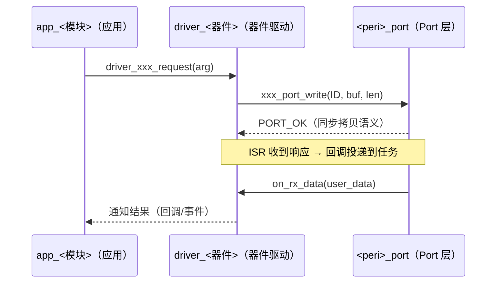

<!-- 时序图骨架：规范见 references/mermaid_sequence_guide.md -->
<!-- 硬规则：参与者 id 英文（中文放 as 之后）；全部参与者显式声明；
     消息文本用接口函数签名（进 manifest 的签名以此为准）；
     回调方向必须画出；一模块一图；不允许越层调用 -->

<!--
语法子集（全部可选写法）：
    participant X [as 名称]   声明参与者（建议全部显式声明）
    actor X                   角色参与者
    A->>B: msg                同步调用
    A-->>B: msg               返回 / 异步通知（含回调）
渲染可见但不参与 diff：Note、loop/alt/opt、activate/deactivate
提示：参与者删除未声明会被 diff 漏检——不要省略 participant 声明
-->
