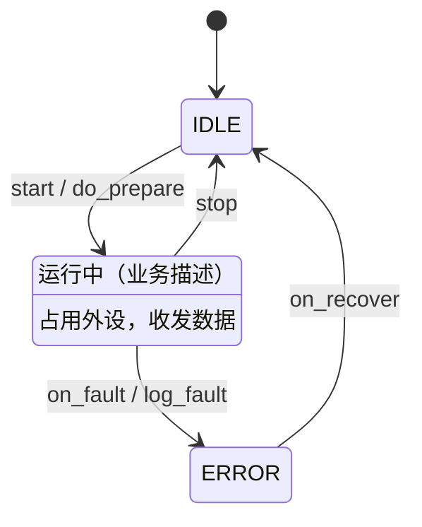

<!-- 状态机图骨架：规范见 references/mermaid_state_guide.md -->
<!-- 硬规则：状态名全大写下划线；事件/动作小写下划线；必须有 [*] 初始迁移；
     只用下方注释列出的语法子集；一模块一图；Agent 不得自行置 approved -->

<!--
语法子集（全部可选写法）：
    [*] --> A              初始迁移（必须至少一条）
    A --> [*]              终止迁移
    A --> B : evt          迁移 + 事件
    A --> B : evt / action 迁移 + 事件 + 动作
    state "描述" as A      状态别名
    A : 描述               状态描述行
不支持（写了不参与 diff）：复合状态 state X {}、note、direction
-->
