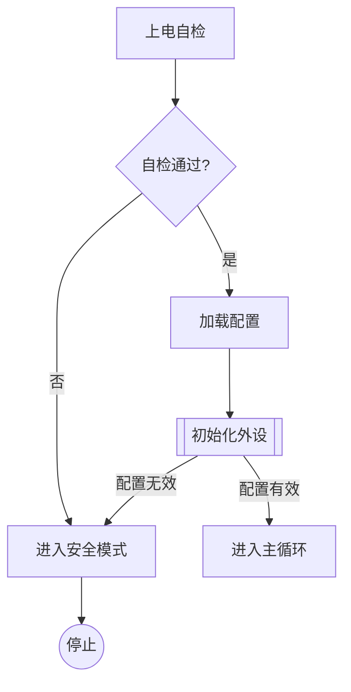

# 顺序流程图规范（Mermaid flowchart TD，S5b Agent 编写 `<模块>_flow.md` 的规范）

> 适用范围：按步骤顺序执行的处理逻辑（初始化序列、数据加工管道、通信收发处理、错误处理流程等），无显著状态机语义的模块。
> 图类型由系统决定：**顺序逻辑 → 文件名必须为 `<模块>_flow.md`，图类型固定 `flowchart TD`（竖向，IDE 预览阅读友好）**，Agent 不得自选方向（历史图 `LR` 兼容，校验两者皆收）。
> 骨架基座：`assets/flow_skeletons/flowchart_skeleton.md`。
> 本规范与 `scripts/flow_validator.py`（首行必须 `flowchart TD`，兼容 `LR`）、`scripts/analysis.py::_parse_flowchart`（diff 解析）严格对应。

## 一、文件与 front-matter 契约

文件：`<target>/docs/flow/<模块>_flow.md`（模块名 = 对应代码文件基名）。

front-matter 契约与状态机图完全一致（`name`/`status`/`version` 必填、status 生命周期、Agent 不得自行批准），见 `mermaid_state_guide.md` 第一节，此处不重复。

## 二、语法子集（全部支持写法）

| 写法 | 作用 | diff 视角 |
|---|---|---|
| `A[矩形]` | 处理节点（做一件事） | 节点 = (id, label)；**label 变化记为 modified 边** |
| `A([圆角])` | 起止节点 | 同上 |
| `A{菱形}` | 判断节点 | 同上 |
| `A[[子程序形]]` | 调用子流程/函数 | 同上 |
| `A((圆形))` | 连接点/终止点 | 同上 |
| `A --> B` | 无条件边 | 边 = (from, to, "") |
| `A -->|cond| B` | 带条件边 | 边 = (from, to, cond) |
| `A -- text --> B` | 带文字边（等价写法） | 边 = (from, to, text) |
| `A --- B` | 无箭头连线 | 计入边 |
| `%% 注释` | 注释 | 忽略 |

**不支持参与 diff**：`subgraph`/`end`/`direction` 行（渲染可见但 diff 忽略）、节点形状以外的样式（`style`/`classDef`）、`-.->`/`==>` 箭头变体（会被解析但请统一用 `-->`，保证 diff 边统计稳定）。

## 三、命名规范

1. **节点 id**：短英文标识符（`A`/`B2`/`INIT`），只在图内使用；**中文写在 label 里**，不要用中文 id。
2. **节点 label**：处理节点用动宾短语（`加载配置`、`发送AT命令`）；判断节点用疑问句式（`超时?`、`CRC校验通过?`），且**必须可在代码中直译为条件表达式**。
3. **边条件**：`是/否`、`OK/NG`、具体值（`len>0`）均可，但要与判断节点的问句对应（`超时?` 的出边写 `是`/`否`，不写 `1`/`0`）。
4. **label 修改的成本提示**：diff 中"同一起止点、label 变化"记为 modified 边并计入变化率；改 label 前先确认是否真的语义变化（仅措辞调整也会触发 incremental，属浪费变更额度）。

## 四、画法要求（内容质量）

- **单入口**：图必须有明确起点（无入边的节点只允许一个）。
- **出口完备**：判断节点的每条出边条件必须覆盖全部情况（是/否成对；不画"不可能分支"也不漏默认分支）。
- **节点粒度**：一个节点 = 一个可命名函数体的工作量；太粗（超过 ~30 行代码的工作量）要拆节点，太细（一行赋值）应合并到相邻节点。
- **子流程复用**：多处调用的逻辑用 `[[子程序形]]` 节点引用，被引用逻辑单独成模块流程图；不要复制粘贴节点链。
- **竖向 TD 下的层级阅读**：主线放左侧一列，保证渲染后主线从上到下一条直线；异常/回退路径放右侧。
- **错误处理**：失败分支不允许悬空（每个失败分支要么重试回到上游、要么走到明确终点），review 重点。
- **参数表达（软约束）**：节点/边标签中的阈值/周期/超时等数值不内联魔法值，用参数名表达并旁注当前值（如 `超时判断 /* timeout_ms=500 */`），保证审图可读；调参只改代码常量，不改图结构（diff 不受影响）。

## 五、与状态机图的边界

| 特征 | 用 `_state.md` | 用 `_flow.md` |
|---|---|---|
| 有长期驻留的状态、事件驱动切换 | 是 | 否 |
| 顺序执行、有入口和出口 | 否 | 是 |
| 两者都有一点 | 主体语义定图类型；另一面作为节点/边表达（如流程图中的等待判断节点），或拆子模块 | 同左 |

**一模块只允许一张图**（校验强制）：`app_wifi_state.md` 与 `app_wifi_flow.md` 不能共存；确实两种语义都有 → 拆 `app_wifi_conn_state.md`（子模块）。

## 六、自检清单

- [ ] 文件名 `<模块>_flow.md`，`name` 一致，front-matter 齐全，`status: draft`。
- [ ] 图首行是 `flowchart TD`（历史图兼容 `LR`；不得用 `graph`/`TB`）。
- [ ] 判断节点出边条件完备、成对。
- [ ] 节点 id 英文、label 动宾/疑问句式。
- [ ] 只用 `-->` 箭头；无 subgraph。
- [ ] 失败分支无悬空。
