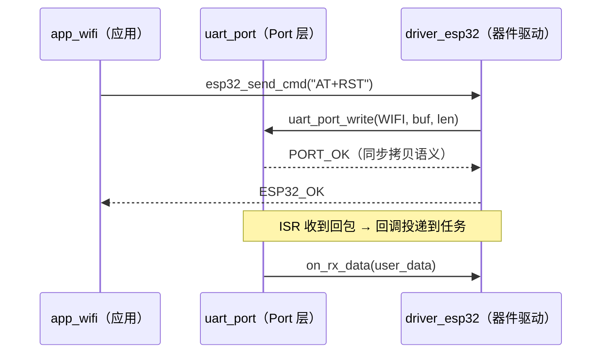

# 时序图规范（Mermaid sequenceDiagram，S5b Agent 编写 `<模块>_sequence.md` 的规范）

> 适用范围：跨模块/跨层的交互协议（模块间调用次序、通信握手机制、中断到任务的投递路径）。单模块内部逻辑不用时序图。
> 图类型由系统决定：**交互时序 → 文件名必须为 `<模块>_sequence.md`，图类型固定 `sequenceDiagram`**。
> 骨架基座：`assets/flow_skeletons/sequence_skeleton.md`。
> 本规范与 `scripts/analysis.py::_parse_sequence_diagram`（diff 解析）严格对应。

## 一、文件与 front-matter 契约

文件：`<target>/docs/flow/<模块>_sequence.md`。

front-matter 契约与状态机图完全一致（`name`/`status`/`version` 必填、status 生命周期、Agent 不得自行批准），见 `mermaid_state_guide.md` 第一节。

## 二、语法子集（全部支持写法）

| 写法 | 作用 | diff 视角 |
|---|---|---|
| `participant X` / `participant X as 名称` | 声明参与者 | 计入节点 |
| `actor X` | 声明角色参与者 | 计入节点 |
| `A->>B: msg` | 实线实箭头（调用/请求） | 边 = (A, B, msg) |
| `A-->>B: msg` | 虚线实箭头（返回/响应/异步通知） | 计入边 |
| `A->B: msg` / `A--)B: msg` | 变体（少用，统一用上两种） | 计入边 |
| `Note over A,B: 文本` | 说明注记 | **忽略**（渲染可见，不参与 diff） |
| `loop`/`alt`/`opt`/`activate`/`deactivate` | 结构块 | **忽略**（渲染可见，不参与 diff） |
| `%% 注释` | 注释 | 忽略 |

**参与者 id 必须是英文标识符**（`[A-Za-z_][\w]*`）：`APP`/`PORT` 合法，`应用层` 非法（中文名放 `as` 之后）。未声明 participant 直接发消息也可（自动建参与者），但**建议显式声明全部参与者**——参与者清单是模块间接口关系的直接体现，省略会导致 diff 漏检参与者删除。

**至少要有一条消息**（校验强制：解析不到参与者/消息直接报错）。

## 三、命名规范

1. **参与者 id**：层角色或模块短名——`APP`/`OSAL`/`PORT`/`DRV`/`ISR`，或直接用模块名（`APP_WIFI`）。同一张图内参与者代表"模块角色"，不是具体硬件。
2. **参与者显示名**：`as` 后写"模块名（层名）"，如 `as uart_port（Port 层）`。
3. **消息文本**：调用方写接口函数签名风格（`uart_port_write(WIFI, buf, len)`），返回写 `返回值（语义）`（`PORT_OK（同步拷贝语义）`）。消息文本中的函数名必须与实际生成的接口签名一致——**时序图是 Port 接口设计的草稿纸，这里写的函数名会进 manifest**。
4. **方向语义**：`->>` 同步调用；`-->>` 返回值或异步通知（含回调），回调消息标注触发方（如 `on_rx_data(user_data)【ISR 投递】`可用 Note 补充上下文）。

## 四、画法要求（内容质量）

- **纵向时间轴 = 因果序**：自上而下严格按发生顺序；不得画"预期未来重构后"的调用。
- **跨层边界清晰**：APP↔DRV↔PORT 的每条消息都要走真实层次（app 不允许直接 `->>PORT` 调 Port 接口——发现越层调用说明模块划分有问题，回拆分步骤修正）。
- **回调方向必须画出**：ISR/中断回调、注册-触发路径是嵌入式时序的核心内容，省略回调等于没画。
- **错误分支**：关键调用的失败返回（`-->>` 返回错误码）与重试要画，用 `alt` 块分组（渲染友好，diff 忽略块结构但统计其中的消息行）。
- **范围收束**：一张时序图讲一个交互场景（"上电初始化握手"）；多场景拆多张图（`<模块>_<场景>_sequence.md`，场景并入模块名段）。
- **参数表达（软约束）**：消息文本中的超时/重试次数等数值不内联魔法值，用参数名表达并旁注当前值（如 `等待响应 /* timeout_ms=200 */`），保证审图可读；调参只改代码常量，不改图结构（diff 不受影响）。

## 五、自检清单

- [ ] 文件名 `<模块>_sequence.md`，`name` 一致，front-matter 齐全，`status: draft`。
- [ ] 图首行是 `sequenceDiagram`；全部参与者显式声明且 id 英文。
- [ ] 消息文本的函数签名与 Port 接口设计一致（后续 manifest 登记同一批签名）。
- [ ] 回调路径已画出、方向正确。
- [ ] 关键失败分支有返回消息。
- [ ] 无越层调用（APP 直调 Port、DRV 调 APP 等）。
