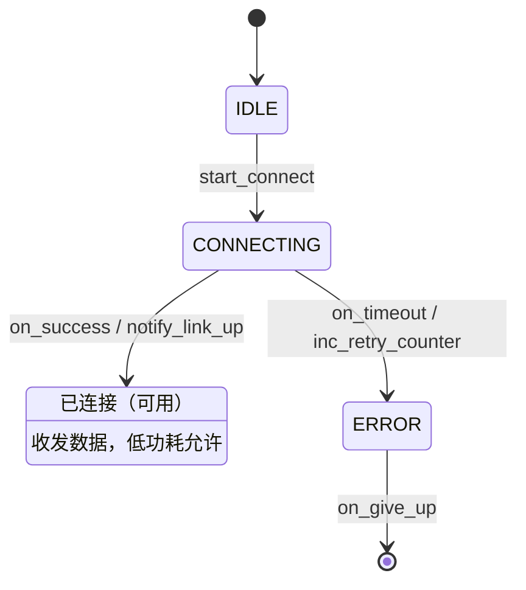

# 状态机图规范（Mermaid stateDiagram-v2，S5b Agent 编写 `<模块>_state.md` 的规范）

> 适用范围：具有明显"状态-迁移"语义的功能模块（连接管理、充电流程、传感器采样状态机等）。
> 图类型由系统决定：**模块语义是状态机 → 文件名必须为 `<模块>_state.md`，图类型固定 `stateDiagram-v2`**，Agent 不得自选。
> 骨架基座：`assets/flow_skeletons/state_skeleton.md`。
> 本规范与 `scripts/flow_validator.py`（规范校验）、`scripts/analysis.py::_parse_state_diagram`（diff 解析）的语法子集严格对应——超出子集的写法不参与 diff，等于白写。

## 一、文件与 front-matter 契约

文件：`<target>/docs/flow/<模块>_state.md`（模块名 = 对应代码文件基名，如 `app_wifi_state.md` ↔ `app_wifi.c`）。

```yaml
---
name: app_wifi_state          # 必填，与文件基名一致（app_wifi_state；也接受模块名 app_wifi）
status: draft                 # 必填：draft/review/approved/dirty/deprecated
version: 1.0                  # 必填，每次定稿后修改需递增（1.0 → 1.1）
created_at: 2026-09-21T10:00:00
approved_at: null             # 用户批准后由 Agent 填写（Agent 不得自行批准）
approved_by: null
base_version: null            # 基于哪个旧版本修改（增量时填旧版本号）
---


```

**status 生命周期（硬规则）**：

| 状态 | 含义 | 约束 |
|---|---|---|
| `draft` | 初稿 | Agent 生成/修改后保持此状态，**不生成代码** |
| `review` | 待审核 | 同 draft，语义上表示已请用户看 |
| `approved` | 定稿 | 必须有 `approved_at`（缺了校验直接报错）；生成代码的前提 |
| `dirty` | 定稿后被改 | 校验拦截：必须重新审核（用户确认后回 `approved` 且 `version` 递增） |
| `deprecated` | 废弃 | 不处理，代码由用户决定去留 |

**Agent 不得将流程图自行置为 `approved`**——必须用户明确确认后才代为修改，并填写 `approved_at`/`approved_by`。

## 二、语法子集（全部支持写法）

只允许以下写法（其余 Mermaid 语法渲染可能正常，但 **flow_differ 不解析，diff 时视为不存在**）：



| 写法 | 作用 | diff 视角 |
|---|---|---|
| `[*] --> A` | 初始迁移（**必须至少一条**，否则校验报错） | 计入边 |
| `A --> [*]` | 终止迁移（有终态时写） | 计入边 |
| `A --> B : evt` | 迁移 + 触发事件 | 边 = (from, to, event) |
| `A --> B : evt / action` | 迁移 + 事件 + 动作 | `evt / action` 整体作为边标签参与 diff |
| `state "描述" as A` | 状态别名（中文描述放这里） | 计入节点，描述不参与 diff |
| `A : 描述` | 状态附加描述行 | 计入节点，描述不参与 diff |
| `%% 注释` | 注释 | 全部忽略 |

**不支持**（写了也不报错，但不参与节点/边提取与 diff）：复合状态 `state X { }`、`note right/left of`、`direction`、`-->` 之外的箭头样式。如需分组，请拆子模块各画一张图。

## 三、命名规范（校验/警告规则）

1. **状态名**：全大写下划线，`[A-Z_][A-Z0-9_]*`（如 `IDLE`、`RECONNECTING`）。小写状态名触发警告。
   语义前缀风格推荐：`ST_` 前缀可省略，直接用业务词（`CONNECTED` 而非 `ST_CONNECTED`——枚举前缀在代码映射时统一加，见 `flow_to_code_mapping.md`）。
2. **事件名**：小写下划线、动词开头（`start_connect`、`on_timeout`）。推荐 `on_XXX`（回调/异步事件）与动词祈使句（同步指令）两种。
3. **动作名**：小写下划线、动词开头（`inc_retry_counter`、`notify_link_up`），且必须是**可映射为函数名**的标识符（见映射规则）。
4. **模块名**（文件名/`name` 字段）：小写下划线，与代码文件基名一致（`app_wifi`、`driver_key`）。

## 四、画法要求（内容质量）

- **一个状态机的全部状态必须出现在同一张图里**——状态机不允许"流程图补充一张"（一模块一图，校验强制）。
- 初始态 `[*]` 指向的必须是真实静止状态（通常是 `IDLE`/`POWER_ON`），不能直接指向瞬态。
- 迁移标签三段式优先：`事件 / 动作`；只有事件无动作时不写 `/`；无条件自迁移（如 `CONNECTING --> CONNECTING : on_probe`）允许但避免滥用。
- 错误/超时路径必须画全：每个非瞬态状态在异常场景下的去向（回到 IDLE、进 ERROR、重试）不可省略——这是 review 重点。
- 状态数量建议 ≤ 10；超过时考虑拆子模块（子模块单独一张 `_state.md`，父模块迁移到子模块用一条边表达）。
- **参数表达（软约束）**：迁移标签中的阈值/周期/超时/次数等数值不内联魔法值，用参数名表达并旁注当前值（如 `超时判断 /* timeout_ms=500 */`、`重试 /* max_retry=3 */`），保证审图可读；调参只改代码常量，不改图结构（diff 不受影响）。

## 五、自检清单（提交 review 前逐条核对）

- [ ] 文件名 `<模块>_state.md`，`name` 与模块一致，front-matter 三必填字段齐全。
- [ ] 图首行是 `stateDiagram-v2`，含至少一条 `[*] -->` 初始迁移。
- [ ] 所有状态名全大写下划线、事件/动作全小写下划线。
- [ ] 只用了第二节语法子集；无复合状态、无 note。
- [ ] 每个非瞬态状态都有异常路径去向。
- [ ] `status: draft`，未擅自置 approved。
